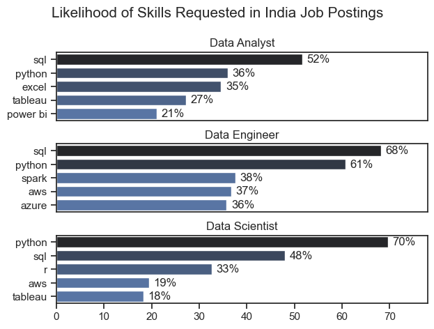
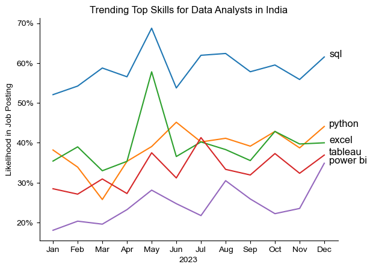
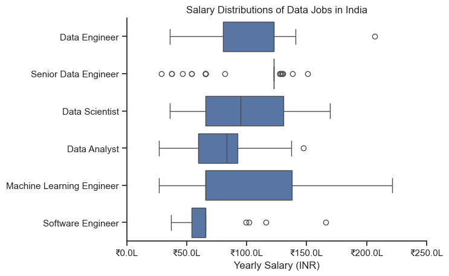
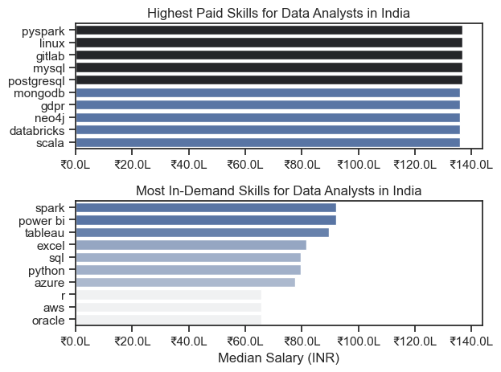
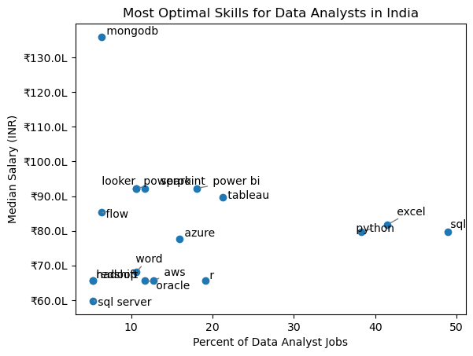
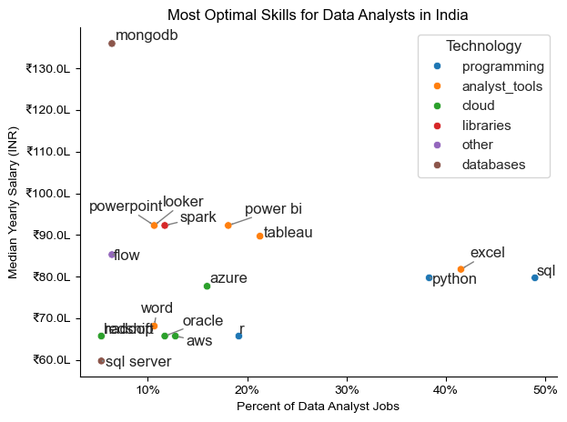

# 🇮🇳 India Data Analytics Job Market Analysis

# Overview

Welcome to my analysis of the Indian data job market, with a focus on Data Analyst roles and related careers in data. This project was created to better understand the rapidly growing analytics industry in India and identify the most valuable skills for aspiring data professionals.

Using real-world job posting data, this project explores salary trends, in-demand skills, hiring patterns, and the relationship between skill demand and compensation in the Indian data job market.

The dataset used in this project is based on the public dataset provided in Luke Barousse’s Python Data Analytics Course. I modified and adapted the analysis specifically for the Indian job market to uncover region-specific insights and trends.

---

# The Questions

Below are the key questions explored in this project:

1. What are the most in-demand skills for the top data roles in India?
2. How are data analyst skills trending in India?
3. Which skills and roles offer the highest salaries in India?
4. What are the most optimal skills for data analysts to learn in India? (High Demand + High Salary)

---

# Tools & Technologies Used

This project was completed using the following tools and technologies:

- **Python**
- **Pandas**
- **Matplotlib**
- **Seaborn**
- **Jupyter Notebook**
- **VS Code**
- **Git & GitHub**

### Python Libraries Used

- **Pandas** → Data cleaning and analysis
- **Matplotlib** → Data visualization
- **Seaborn** → Statistical visualization
- **AST** → Converting skill strings into Python lists
- **Datasets (Hugging Face)** → Loading the dataset

---

# Data Preparation & Cleaning

## Import Libraries & Load Dataset

```python
import ast
import pandas as pd
import seaborn as sns
from datasets import load_dataset
import matplotlib.pyplot as plt

# Load Dataset
dataset = load_dataset('lukebarousse/data_jobs')
df = dataset['train'].to_pandas()

# Data Cleaning
df['job_posted_date'] = pd.to_datetime(df['job_posted_date'])

df['job_skills'] = df['job_skills'].apply(
    lambda x: ast.literal_eval(x) if pd.notna(x) else x
)
```

---

## Filter Indian Jobs

To focus specifically on the Indian job market, I filtered the dataset to include only job postings located in India.

```python
df_India = df[df['job_country'] == 'India']
```

---

# The Analysis

Each notebook in this project focuses on answering a specific question about the Indian data job market.

---

# 1. Most In-Demand Skills for Top Data Roles in India

To identify the most demanded skills in India, I analyzed the top data-related roles and extracted the most frequently requested skills from job postings.

The analysis highlights which technical skills are most valuable depending on the role being targeted.

### Visualize Data

```python
fig, ax = plt.subplots(len(job_titles), 1)

for i, job_title in enumerate(job_titles):

    df_plot = df_skills_perc[
        df_skills_perc['job_title_short'] == job_title
    ].head(5)[::-1]

    sns.barplot(
        data=df_plot,
        x='skill_percent',
        y='job_skills',
        ax=ax[i],
        hue='skill_count',
        palette='dark:b_r'
    )

plt.show()
```

---
### Results



---

### Insights

- SQL and Python are among the most requested skills across nearly all data-related roles in India.
- Data Analysts frequently require tools such as Excel, Power BI, SQL, and Tableau.
- Data Engineers show stronger demand for cloud and big data technologies like AWS, Spark, and Azure.
- Python remains one of the most versatile and valuable skills across Data Analyst, Data Scientist, and Data Engineer roles.

---

# 2. Trending Skills for Data Analysts in India

To understand changing skill demand trends, I analyzed monthly job postings for Data Analysts in India and tracked the popularity of key technical skills throughout the year.

### Visualize Data

```python
from matplotlib.ticker import PercentFormatter

df_plot = df_DA_India_percent.iloc[:, :5]

sns.lineplot(
    data=df_plot,
    dashes=False,
    legend='full',
    palette='tab10'
)

plt.gca().yaxis.set_major_formatter(
    PercentFormatter(decimals=0)
)

plt.show()
```

---

### Results



---

### Insights

- SQL maintained consistently high demand throughout the year in India.
- Power BI and Excel showed increasing popularity in analyst job postings.
- Python remained highly relevant for analytics and automation-related tasks.
- Visualization tools such as Tableau and Power BI continued to grow in importance for business reporting roles.

---

# 3. Salary Analysis for Data Roles in India

To understand compensation trends, I analyzed salary distributions across major data roles in India including:

- Data Analyst
- Data Scientist
- Data Engineer
- Senior Data Analyst
- Senior Data Scientist
- Senior Data Engineer

### Visualize Data

```python
sns.boxplot(
    data=df_India_top6,
    x='salary_year_avg',
    y='job_title_short',
    order=job_order
)

ticks_x = plt.FuncFormatter(
    lambda y, pos: f'₹{int(y/1000)}K'
)

plt.gca().xaxis.set_major_formatter(ticks_x)

plt.show()
```

---

### Results



---

### Insights

- Senior-level data roles generally command significantly higher salaries in India.
- Data Engineers and Data Scientists tend to earn more than Data Analysts due to specialized technical requirements.
- Salary variation increases with seniority and technical specialization.
- Strong programming and cloud-related skills contribute to higher compensation.

---

# Highest Paid & Most In-Demand Skills for Data Analysts in India

This analysis focuses specifically on identifying:

- Highest-paying skills
- Most in-demand skills

for Data Analysts in India.

### Visualize Data

```python
fig, ax = plt.subplots(2, 1)

# Highest Paying Skills
sns.barplot(
    data=df_DA_top_pay,
    x='median',
    y=df_DA_top_pay.index,
    hue='median',
    ax=ax[0],
    palette='dark:b_r'
)

# Most In-Demand Skills
sns.barplot(
    data=df_DA_skills,
    x='median',
    y=df_DA_skills.index,
    hue='median',
    ax=ax[1],
    palette='light:b'
)

plt.show()
```

---

### Results



---

### Insights

- Specialized technical skills such as Python, cloud technologies, and advanced databases are associated with higher salaries.
- Core tools like Excel, SQL, and Power BI remain highly demanded in the Indian analytics market.
- Data analysts benefit from combining foundational business tools with advanced programming skills.
- Skills involving automation and cloud platforms show strong salary potential in India.

---

# 4. Most Optimal Skills for Data Analysts in India

To determine the most valuable skills to learn, I combined:

- Skill demand percentage
- Median salary

This helps identify skills that are both highly demanded and highly paid.

### Visualize Data

```python
plt.scatter(
    df_DA_skills_high_demand['skill_percent'],
    df_DA_skills_high_demand['median_salary']
)

plt.show()
```

---

### Results



---

### Insights

- Python continues to offer strong salary potential while remaining highly demanded.
- SQL remains one of the safest and most essential skills for data professionals.
- Visualization tools like Tableau and Power BI provide excellent career opportunities in India.
- Cloud and database technologies show increasing salary advantages in the Indian job market.

---

# Visualizing Technologies by Category

To better understand skill categories, I grouped technologies into areas such as:

- Programming
- Databases
- Analyst Tools
- Cloud Platforms

### Visualize Data

```python
scatter = sns.scatterplot(
    data=df_DA_skills_tech_high_demand,
    x='skill_percent',
    y='median_salary',
    hue='technology',
    palette='bright',
    legend='full'
)

plt.show()
```

---

### Results

  

---

### Insights

- Programming skills generally align with higher salary ranges.
- Database technologies remain highly valuable for analytics professionals.
- Business Intelligence tools continue to dominate analyst job requirements.
- Cloud-related technologies are becoming increasingly important in India’s growing tech ecosystem.

---

# What I Learned

This project helped me improve both my analytical thinking and technical skills.

### Key Learnings

- Advanced data analysis using Python and Pandas
- Data cleaning and preprocessing techniques
- Creating insightful visualizations using Matplotlib and Seaborn
- Understanding real-world hiring trends in India
- Identifying relationships between skill demand and salary

---

# Challenges Faced

Some challenges encountered during the project included:

- Handling missing and inconsistent data
- Managing complex skill datasets
- Creating meaningful visualizations
- Filtering and analyzing region-specific job market trends

These challenges helped strengthen my problem-solving and data analysis skills.

---

# Key Insights

Some important insights from this project include:

- SQL, Python, and Power BI dominate the Indian analytics market.
- Specialized technical skills generally lead to higher salaries.
- Data visualization and business intelligence tools are highly valuable.
- Continuous learning is essential due to rapidly changing technology trends.

---

# Conclusion

This project provided valuable insights into the Indian data analytics job market and highlighted the skills most relevant for aspiring data professionals.

The analysis demonstrates how technical skills, market demand, and salary trends are interconnected. It also emphasizes the importance of continuously learning modern tools and technologies to stay competitive in the evolving analytics industry.

This project serves as both a practical data analysis portfolio project and a strong foundation for future explorations into India's growing data ecosystem.
